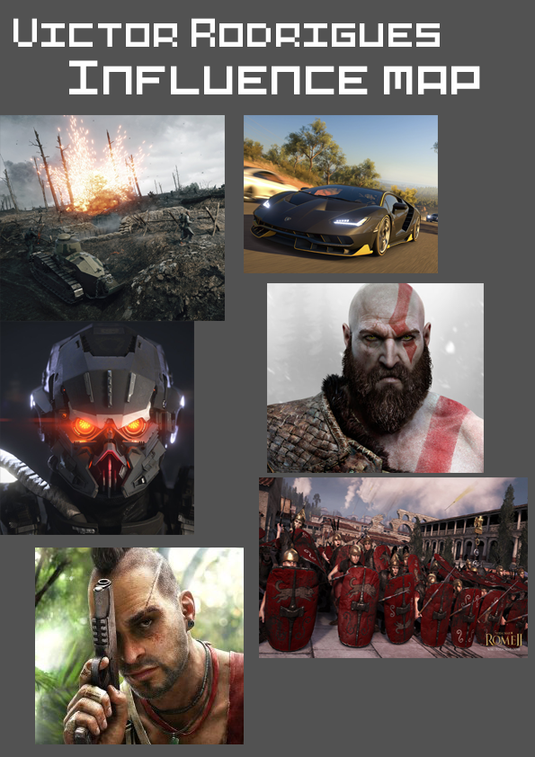
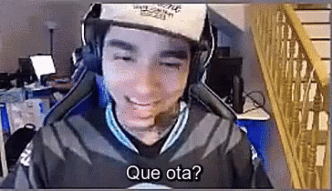
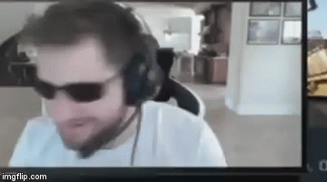

---
layout: default
---  

# **Quem sou eu!?**  
* * *
  **Foto que melhor me representa**    
**Aluno de Programação de Jogos Digitais do Instituto Federal de Ciencia e Tecnologia Do Rio Grande do Norte Ceará-Mirim, Victor "Frosty" Rodrigues. Natural de Ceará- Mirim RN, 17 anos, Futuro desenvolvedor de Jogos Digitais**      
***Student of Programming of Digital Games of the Federal Institute of Science and Technology of Rio Grande do Norte Ceará-Mirim, Victor "Frosty" Rodrigues. Natural from Ceará - Mirim RN, 17 years old, Future developer of Digital Games, ~~my english is so bad~~***   
* * * 
# Portfólio 
  _Durante o ano de 2017 e 2018 minha turma de programação digital fizemos varios projetos de jogos digitais abaixo você consigirá velos é prestigia-los.   
During the year 2017 and 2018 my class of digital programming we made several projects of digital games below you will get veils is prestigia them. 
All the descriptions are in pt br, for more information look in "Contatos"._
* * *  
## Games  
1. Akili [Jogo 1](https://elielton90.github.io/Akili/)    
_Entre na pele de uma garotinha a procura da cura da sua maldição. Jogo plataforma.PC._   
2. Express [Jogo 2](https://eriksonnicacio.github.io/New%20project/)   
_Arruma essas cartas! Jogo Touch. Pc/Celular._   
3. Ardenas Retake [Jogo 3](https://jldifrn.github.io/ArdenasRetake/)       
_Reconquiste o seu territorio_ Jogo Plataforma.Pc._   
4. Bacteria [Jogo4](https://eriksonnicacio.github.io/bacteria2/)   
_Conheça o seu pior pesadelo, as bacterias. Jogo Tower defence. Pc/celular._   
* * *     
## Artes  
* * *    

**Uma das mais importantes empresas que participo.**

    
**Um pouco das artes dos Jogos Produzidos**   
**Akili**
    
**Ardenas Retake**   
     
       

* * *
### Trabalhos de Animação    
   
   
      
### Mapa de Influência   
* * *   

* * *   

### Parcerias      
* * * 
**Maior tutor de todos os tempos** [Marcelo Barbosa](http://marcelomesmo.github.io/)   
[Elielton Torres](eriksonnicacio.github.io)      
[Erikison Pedro](eriksonnicacio.github.io)   
[Jose Luiz Dantas](jldifrn.github.io)   
* * *   
## Premiações    
**"5 arnold,7 norte nordeste, 6 bbb, 10 soletrando, 3 mega da virada, 8 major."**   
* * *
## Contatos  
* * *   
[steam](http://steamcommunity.com/id/vitorr1232/)   
* * *
## Gifs   
* * *   
   
   
* * *

